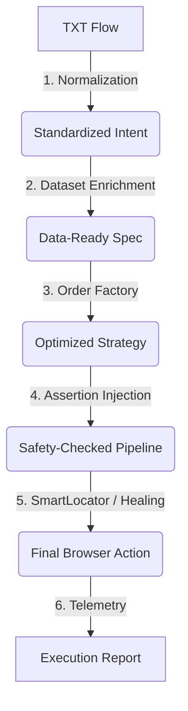

# QA Automation Platform Handbook (Phase-7 Edition)

> [!IMPORTANT]
> **Core Policy**: QA teams should **NEVER** automate cart, checkout, address, or payment steps manually using individual clicks. Always use the high-level `create order` primitives provided by the platform.

Welcome to the Playwright Automation Platform for Tata 1mg! This guide is designed to take a non-technical QA from a blank repository to production-ready automation using simple "TXT flows".

---

## 1. Concept Summary: The "Magic" Behind the Flows

Instead of writing code, you write instructions in plain English. The platform transforms these into execution via a structured pipeline.

### 1.1 The Execution Lifecycle
To troubleshoot effectively, you must understand how your text becomes a test:



### 1.2 The Assertion Hierarchy
Assertions are injected automatically at three levels:
1.  **Registry Metadata**: Implicit checks (e.g., clicking 'Search' always verifies if the loader disappears).
2.  **Flow Metadata**: Checks defined in your `.meta.yaml` to validate the specific end-state.
3.  **Environment Rules**: Security or compliance checks that shift based on `TEST_ENV`.

---

## 2. Setting Up Your Squad's Child Repo

Squads operate in "Child Repositories" that inherit power from the Core Platform.

### 2.1 Sample Directory Tree
Your repository must follow this structure exactly:
```text
your-squad-automation/
├── flows/                       # Your .txt and .meta.yaml files
├── locator-registry/
│   └── services/
│       └── your-service.yaml    # YOUR squad's element dictionary
├── datasets/
│   ├── skus/                    # Product data for your domain
│   └── users/                   # Test accounts (Environment specific)
└── package.json                 # Dependency: playwright-automation-core
```

### 2.2 Bootstrap Guide

#### Option A: Automated Setup (Recommended)
1.  **Create a new directory** for your squad automation:
    ```bash
    mkdir my-squad-automation
    cd my-squad-automation
    ```

2.  **Install the core platform**:
    ```bash
    npm init -y
    npm install playwright-automation-core @playwright/test
    ```

3.  **Run quickstart scaffolding**:
    ```bash
    npx playwright-automation-core quickstart
    ```
    This will create:
    - Directory structure (`flows/`, `locator-registry/`, `datasets/`)
    - Example flow files
    - Sample locator registry
    - Template datasets
    - Pre-configured `package.json` with npm scripts

4.  **Validate your setup**:
    ```bash
    npm run doctor
    ```

#### Option B: Manual Setup
1.  **Create directories**:
    ```bash
    mkdir -p flows locator-registry/services datasets/{skus,users,addresses,payments}
    ```

2.  **Install dependencies**:
    ```bash
    npm init -y
    npm install playwright-automation-core @playwright/test
    ```

3.  **Add npm scripts** to your `package.json`:
    ```json
    {
      "scripts": {
        "doctor": "npx playwright-automation-core doctor",
        "preview-flow": "npx playwright-automation-core preview-flow",
        "validate-flow": "npx playwright-automation-core validate-flow",
        "run-intent": "npx playwright-automation-core run-intent",
        "explain-flow": "npx playwright-automation-core explain-flow"
      }
    }
    ```

4.  **Validate**:
    ```bash
    npm run doctor
    ```

### 2.3 How Child Repos Inherit from Core Platform

Child repositories inherit capabilities through the installed `playwright-automation-core` npm package:

1.  **Core Engine**: All DSL parsing, registry loading, and OrderFactory logic is in the core package
2.  **Default Datasets**: The core provides platform-wide datasets (addresses, payments, common SKUs)
3.  **CLI Commands**: Available through `npx playwright-automation-core <command>` or npm scripts
4.  **Registry Resolution**: Your child repo's registries **extend** (not replace) the core registries
5.  **Dataset Merging**: Child repo datasets override core defaults when keys match

**The Platform looks for files in this order:**
1.  Your child repo (e.g., `./locator-registry/services/my-service.yaml`)
2.  Core platform (e.g., `node_modules/playwright-automation-core/locator-registry/global/`)

This means you only need to define what's unique to your squad!

---

## 3. The Development Lifecycle (Standard Workflow)

Follow this 5-step loop for every new test. **Skipping step 2 is the #1 cause of flaky tests.**

1.  **Create**: Write your logic in `flows/my-feature.txt`.

2.  **Explain** (Optional but helpful): Understand what your flow does:
    ```bash
    npm run explain-flow flows/my-feature.txt
    ```
    This provides a natural language explanation of each step.

3.  **Preview** [**MANDATORY**]: Check that datasets and parameters resolve correctly:
    ```bash
    npm run preview-flow flows/my-feature.txt
    ```
    
4.  **Validate**: Ensure syntax is correct:
    ```bash
    npm run validate-flow flows/my-feature.txt
    ```

5.  **Run**: Execute the flow:
    ```bash
    npm run run-intent flows/my-feature.txt
    ```

6.  **Debug**: If it fails:
    - Check the HTML report (opens automatically)
    - Verify datasets resolved correctly (`preview-flow`)
    - Check if locators have changed (update your registry)
    - Run `npm run doctor` to verify environment health

---

## 4. Writing TXT Flows (The Authoring Contract)

The system works by matching your words to "Actions". To keep the pipeline stable, you must follow the contract.

### 4.1 Syntax Rules
- **One Instruction per Line**: Never use "and" or "then" to combine steps.
- **No Raw Selectors**: Never use `#id` or `.class`. Use logical terms from your registry.
- **Use Dataset Keys**: Never type raw emails or SKU IDs. Use a **`dataset_key`** (an alias like `default_user`).

### 4.2 Standard Grammar
Use these patterns. The system will handle the "Grammar Normalization" (Standardizing "click", "tap", "press" into one action).

- `navigate to [page_name]`
- `click [locator_name]`
- `fill [locator_name] with [dataset_key]`
- `assert [condition_name]`
- `include:flow:[path]`

### 4.3 OrderFactory Syntax (The "Big Step")
Standardize your transaction tests using this specific grammar:
```text
create order type=otc
create order type=rx with prescription
create order type=mixed with split-delivery and coupon "SAVE20"
```

---

## 5. Dataset Provider Engine

The `DatasetProvider` is the brain that finds the right data for the right environment.

### 5.1 What gets Resolved?
When you say `fill address with default_address`, the provider resolves:
- **SKU**: Finds an in-stock product for your specific squad.
- **Vendor**: Selects an active partner for that environment.
- **Address & Payment**: Pulls environment-safe fake data.
- **User**: Selects a seeded test account with the correct permissions.

### 5.2 When to Override?
- **Platform Defaults**: Use these for 90% of your tests (standard addresses/payments).
- **Child Repo Overrides**: Add a file in `datasets/` only if your feature requires a **unique** SKU (e.g., Cold Chain products) or a **unique** user role (e.g., Admin Panel user).

---

## 6. Locator Registry Governance

Ownership is decentralized: you own your service, the platform owns the core.

### 6.1 Naming Conventions
Follow these to prevent "Registry Entropy":
- ✅ **GOOD**: `order-search-input`, `checkout-proceed-btn` (Semantic & Functional).
- ❌ **BAD**: `div-1-wrapper`, `red-button`, `top-left-link` (Position or Style based).

### 6.2 Governance Rules
- **Extend, Don't Override**: Never redefine core elements (like the 'Home' link).
- **Service Isolation**: Keep your squad's locators inside your specific `your-service.yaml`.

---

## 7. SmartLocator & Healing

The platform is designed to be **Self-Healing**. 

1.  **The Behavior**: If a button's ID changes, the engine uses visual and textual heuristics to find it anyway.
2.  **Telemetry**: The report will show "Healed Success" in yellow.
3.  **Your Action**: When a test "heals", the platform will suggest a new locator. **You should update your registry with this suggestion** to keep the suite fast.

---

## 8. CLI Command Reference

All commands can be run using npm scripts (recommended) or directly with npx.

### 8.1 Setup & Scaffolding

| Command | npm Script | Purpose |
| :--- | :--- | :--- |
| `npx playwright-automation-core quickstart [path]` | N/A | Scaffolds the basic folder structure and example files for a new squad repo. |
| `npx playwright-automation-core doctor` | `npm run doctor` | Health check for your environment, configuration, and dependencies. |

### 8.2 Flow Development

| Command | npm Script | Purpose |
| :--- | :--- | :--- |
| `npx playwright-automation-core explain-flow <file>` | `npm run explain-flow <file>` | Provides a natural language explanation of what the flow does step-by-step. |
| `npx playwright-automation-core preview-flow <file>` | `npm run preview-flow <file>` | **[MANDATORY]** Preview normalized intent and dataset resolution before running. |
| `npx playwright-automation-core validate-flow <file>` | `npm run validate-flow <file>` | Check for syntax errors without executing the flow. |

### 8.3 Execution

| Command | npm Script | Purpose |
| :--- | :--- | :--- |
| `npx playwright-automation-core run-intent <file>` | `npm run run-intent <file>` | Execute a specific TXT flow using the full platform pipeline. |

### 8.4 Validation & Quality

| Command | npm Script | Purpose |
| :--- | :--- | :--- |
| `npx playwright-automation-core validate-datasets` | `npm run validate-datasets` | Ensure all your local SKU/User/Address data is correctly formatted. |
| `npx playwright-automation-core validate-assertions` | `npm run validate-assertions` | Check if your .meta.yaml files match registry capabilities. |
| `npx playwright-automation-core validate-registry` | `npm run validate-registry` | Validate locator registry schema and detect conflicts. |

### 8.5 Command Examples

```bash
# Setup a new squad repo
npx playwright-automation-core quickstart

# Understand what a flow does
npm run explain-flow flows/checkout.txt

# Preview before running (MANDATORY for new flows)
npm run preview-flow flows/checkout.txt

# Validate syntax
npm run validate-flow flows/checkout.txt

# Execute the flow
npm run run-intent flows/checkout.txt

# Health check
npm run doctor
```

---

## 9. Troubleshooting Decision Tree

If a flow fails, follow this systematic debugging approach:

### 9.1 Step 1: Understand the Flow
```bash
npm run explain-flow flows/my-flow.txt
```
- Does the explained behavior match your intent?
- Are there any steps you didn't expect?
- **If NO**: Fix your TXT flow syntax

### 9.2 Step 2: Check Data Resolution
```bash
npm run preview-flow flows/my-flow.txt
```
- Did the `dataset_key` resolve to the correct value?
- Is the `OrderFactory` using the right strategy (UI vs API_HYBRID)?
- Are locators being picked from the right registry?
- **If NO**: Fix your datasets or registry paths

### 9.3 Step 3: Validate Environment
```bash
npm run doctor
```
- Are all required environment variables set? (`TEST_ENV`, `BASE_URL`)
- Is `playwright-automation-core` installed?
- Are dataset directories present?
- **If NO**: Fix `.env` or run `npm install`

### 9.4 Step 4: Review HTML Report
After a failed run, check the HTML report (opens automatically):
- Is a popup or modal blocking the screen? → **Update BasePage interceptors**
- Is the locator highlighted in the wrong place? → **Update Registry**
- Did the test timeout waiting for an element? → **Check if element still exists on page**
- Did a "healed" success occur? → **Update your registry with suggested locator**

### 9.5 Step 5: Common Issues & Fixes

| Symptom | Likely Cause | Fix |
| :--- | :--- | :--- |
| `dataset_key not found` | Dataset file missing or malformed | Run `npm run validate-datasets` |
| `Locator not found in registry` | Registry doesn't have the element | Add it to your service YAML |
| `Element not found` | Selector changed on website | Update selector in registry |
| `Order creation failed` | No valid SKU for environment | Check SKU availability in dataset |
| `Invalid DSL syntax` | Typo or wrong grammar | Run `npm run validate-flow` |
| `Module not found` | Core platform not installed | Run `npm install playwright-automation-core` |

---

## 10. Anti-Patterns to Avoid

- ❌ `wait 5 seconds`: The platform has adaptive waits. If you need a wait, the UI is likely slow—fix the locator wait-state instead.
- ❌ `click xpath=//div[2]`: Never use raw xpaths.
- ❌ `type raw_value`: Use datasets so your tests don't break when production data shifts.
- ❌ `loop manually`: If you need to repeat an action, discuss a new platform primitive with the Core team.

---

## 11. Real-World Example Walkthrough

Let's walk through creating and running your first flow from scratch.

### 11.1 The Flow File (`flows/quick-smoke.txt`)
```text
# Quick smoke test for OTC order flow
navigate to home page
create order type=otc with coupon "HEALTH10"
assert order-id-visible
```

### 11.2 Step 1: Explain the Flow
```bash
npm run explain-flow flows/quick-smoke.txt
```

**Expected Output:**
```
📖 Flow Explanation
================================================================================
File: /path/to/flows/quick-smoke.txt

📋 Flow Summary:
  Total Steps: 3
  Action Breakdown: {"navigate": 1, "create order": 1, "assert": 1}

📝 Step-by-Step Explanation:

Step 1 (Line 2):
  Action: NAVIGATE
  Description: Navigate to: home page
  Details: Opens the specified URL in the browser.

Step 2 (Line 3):
  Action: CREATE ORDER
  Description: Create a OTC order (applies coupon code "HEALTH10")
  Details: Uses the OrderFactory to intelligently create an order. The platform will:
      • Select appropriate products (from dataset)
      • Add items to cart
      • Fill delivery address
      • Select payment method
      • Complete the checkout flow
      Strategy: Will use API_HYBRID mode if available, falling back to UI-only mode.

Step 3 (Line 4):
  Action: ASSERT
  Description: Verify that: order-id-visible
  Details: Checks if the specified condition is true. Test fails if assertion fails.

✅ Explanation complete!
```

### 11.3 Step 2: Preview Data Resolution
```bash
npm run preview-flow flows/quick-smoke.txt
```

**Expected Output:**
```
Normalized (registry-unresolved) Steps:
================================================================================
1. navigate target="home page"
2. create_order type="otc" coupon="HEALTH10"
3. assert target="order-id-visible"
================================================================================

Note: This preview does NOT resolve targets against locator registry.
```

### 11.4 Step 3: Validate Syntax
```bash
npm run validate-flow flows/quick-smoke.txt
```

**Expected Output:**
```
✓ DSL syntax is valid!
  Steps: 3
  Flow: /path/to/flows/quick-smoke.txt
```

### 11.5 Step 4: Run the Flow
```bash
npm run run-intent flows/quick-smoke.txt
```

The platform will:
1.  **Normalize** your DSL into standardized intents
2.  **Resolve datasets**: Find OTC products, apply coupon code
3.  **Select strategy**: API_HYBRID for faster execution
4.  **Inject assertions**: Add implicit checks (cart emptied, inventory updated)
5.  **Execute**: Run through Playwright with self-healing locators
6.  **Report**: Generate HTML report with telemetry

### 11.6 Understanding the Execution
Behind the scenes, the `create order` line expanded into:
- Navigate to product page
- Add SKU to cart (from `otc.json` dataset)
- Proceed to checkout
- Fill address (from `addresses/default.json`)
- Apply coupon "HEALTH10"
- Select payment method (from `payments/default.json`)
- Place order
- **All without you writing a single line of code for these steps!**

---

## 12. Staying Up to Date

The Core Platform evolves weekly. To receive new self-healing algorithms and dataset providers:

1.  **Check for Updates**:
    ```bash
    npm outdated playwright-automation-core
    ```

2.  **Update to Latest**:
    ```bash
    npm install playwright-automation-core@latest
    ```

3.  **Verify After Update**:
    ```bash
    npm run doctor
    ```

4.  **Re-run Existing Tests**: Ensure backward compatibility after major version updates.

---

## 13. Quick Reference Cheat Sheet

### Getting Started
```bash
# New project
npx playwright-automation-core quickstart
npm install

# Verify setup
npm run doctor
```

### Daily Workflow
```bash
# 1. Write flow in flows/my-test.txt
# 2. Understand it
npm run explain-flow flows/my-test.txt

# 3. Preview (MANDATORY)
npm run preview-flow flows/my-test.txt

# 4. Validate syntax
npm run validate-flow flows/my-test.txt

# 5. Run it
npm run run-intent flows/my-test.txt
```

### Common Tasks
```bash
# Add new locators → Edit locator-registry/services/my-service.yaml
# Add test data → Edit datasets/skus/my-products.json
# Validate everything → npm run doctor
# Check datasets → npm run validate-datasets
```

### DSL Quick Reference
```text
# Navigation
navigate to https://example.com
navigate to home page

# Interactions
click button-name
fill input-field with dataset_key
type text-field with value
press Enter

# Assertions
assert element-visible
assert order-completed

# Order Creation (THE BIG ONE!)
create order type=otc
create order type=rx with prescription
create order type=mixed with split-delivery and coupon "CODE"

# Flow Composition
include:flow:flows/login.txt
```

### Troubleshooting Commands
```bash
npm run explain-flow <file>    # What does this flow do?
npm run preview-flow <file>    # Are datasets resolving?
npm run doctor                 # Is environment healthy?
npm run validate-datasets      # Is test data valid?
npm run validate-flow <file>   # Is syntax correct?
```

---

## 14. FAQ (Frequently Asked Questions)

**Q: Do I need to learn JavaScript/TypeScript?**  
A: No! You only write plain English TXT flows. The platform handles all the code.

**Q: Can I use raw CSS selectors in my flows?**  
A: No. Always use semantic names from your locator registry. This keeps tests maintainable.

**Q: What if a locator changes on the website?**  
A: The self-healing engine will find it anyway. Update your registry with the suggested locator after a "healed" run.

**Q: How do I test with different datasets (staging vs production)?**  
A: Set `TEST_ENV=staging` or `TEST_ENV=production` in your `.env` file. The DatasetProvider handles environment-specific data automatically.

**Q: Can I create custom order types beyond OTC/RX?**  
A: Yes! Add your order type to the OrderFactory configuration and create corresponding dataset files.

**Q: Why is `preview-flow` mandatory?**  
A: It catches 90% of issues before execution (wrong datasets, typos, missing locators). Skipping it is the #1 cause of flaky tests.

**Q: My flow works locally but fails in CI. Why?**  
A: Check environment variables (`TEST_ENV`, `BASE_URL`) and ensure datasets are committed to the repo.

**Q: Can I run multiple flows in parallel?**  
A: Yes! Use standard Playwright test runners with `--workers` flag. Each flow is isolated.

**Q: How do I integrate with CI/CD?**  
A: Add npm scripts to your CI pipeline:
```yaml
- run: npm install
- run: npm run doctor
- run: npm run run-intent flows/smoke-tests.txt
```

---

*Welcome to the future of friction-free automation at Tata 1mg! 🚀*

*Questions? Issues? Reach out to the Platform Team or check the GitHub repository.*
